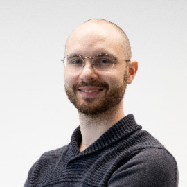

Research Fellow\
Dept. of Econometrics and Business Statistics, Monash Business School, Monash University\
Building 6, 29 Ancora Imparo Way, Clayton\
VIC 3168, Australia\
alexander.ek@monash.edu\
www.alexanderek.com

#### Table of Contents

[Summary](#summary)\
[Education](#education)\
[Positions](#positions)\
[Memberships](#memberships)\
[Recognition](#recognition)\
[Publications](#publications)\
[Teaching](#teaching)\
[Supervision](#supervision)\

## Summary

My research focuses on applying techniques from statistics, computer science, and operations research to solve hard problems, often with uncertainty. Currently, I primarily focus on developing methods for election integrity and auditing.

## Education

2022 - PhD in Computer Science. Monash University, Australia.\
&nbsp;&nbsp;&nbsp;&nbsp;Topic: "High-Level Modelling and Solving for Online, Real-Time, and Multiagent Combinatorial Optimisation"\
&nbsp;&nbsp;&nbsp;&nbsp;Supervisors: Guido Tack, Peter J. Stuckey, Maria Garcia de la Banda, Andreas Schutt.

2018 - BSc + MSc in Computer Science. Uppsala University, Sweden.

## Positions

Mar 2023 and ongoing - **Research Fellow** at Dept. of Econometrics and Business Statistics, Monash Busniess School, Monash University, Australia.

Jul 2022 and ongoing - **Associate Investigator**, [OPTIMA](https://optima.org.au/), Australia.

Jul 2022 to Mar 2023 - **Postdoctoral Research Fellow** at School of Mathematics and Statistics, The University of Melbourne, Australia.

Apr 2021 to Jul 2022 - **Research Student** at OPTIMA, Australia.

Sep 2018 to Jul 2022 - **Research Student** in the Analytics and Decision Sciences Programme of CSIRO's Data61, Melbourne, Australia.

## Memberships

The Association for Constraint Programming (A4CP).

## Recognition

2019 once - Doctoral Program Financial Support. By The Association for Constraint Programming, France.\
2022 once - Graduate Research Completion Award. By Monash University, Australia.\
2022 once - Monash Departmental Scholarship. By Department of Data Science & AI, Monash University, Australia.\
2018-2022 - Data61 Top-up Scholarship. By CSIRO Data61, Australia.\
2018-2022 - Co-Funded Monash Graduate Scholarship. By Monash University, Australia.\
2018-2022 - Faculty of IT International Postgraduate Research Scholarship. By Monash University, Australia.\
2019 once - Doctoral Program Financial Support. By The Association for Constraint Programming, France.\
2014, 2015, 2016 - Johan and Hjalmar Kallenbergs Scholarship (20,000 SEK x3). By Johan and Hjalmar Kallenbergs Foundation, Sweden.

## Publications

### Books and Theses

**Alexander Ek**.
"High-Level Modelling and Solving for Online, Real-Time, and Multiagent Combinatorial Optimisation".
PhD Thesis. Faculty of IT, Monash University, 2022.
[Link](https://doi.org/10.26180/21588144.v1)

**Alexander Ek**.
"Automatic Predicate Encapsulation of Potentially Profitably Presolvable Submodels in MiniZinc".
MSc Thesis. Dept. of IT, Uppsala University. 2018.
[Link](http://urn.kb.se/resolve?urn=urn:nbn:se:uu:diva-351965)

### Journals and Refereed Conferences

#### 2022

**Alexander Ek**, Andreas Schutt, Peter J. Stuckey, and Guido Tack.
"Explaining Propagation for Gini and Spread with Variable Mean".
In: Principles and Practice of Constraint Programming (CP’22). LIPIcs 235. Schloss Dagstuhl, 2022, pp. 21:1-21:16.
[Link](https://doi.org/10.4230/LIPIcs.CP.2022.21)

#### 2020

**Alexander Ek**, Maria Garcia de la Banda, Andreas Schutt, Peter J. Stuckey, and Guido Tack.
“Aggregation and Garbage Collection for Online Optimization”.
In: Principles and Practice of Constraint Programming (CP’20). LNCS 12333. Springer, 2020, pp. 231–247.
[Link](https://doi.org/10.1007/978-3-030-58475-7_14).

**Alexander Ek**, Maria Garcia de la Banda, Andreas Schutt, Peter J. Stuckey, and Guido Tack.
“Modelling and Solving Online Optimisation Problems”.
In: Thirty-Fourth AAAI Conference on Artificial Intelligence (AAAI’20). AAAI Press, 2020, pp. 1477–1485.
[Link](https://doi.org/10.1609/aaai.v34i02.5506).

### Workshops, Symposia, Consortia, Informal Conferences, and Extended Abstracts

**Alexander Ek**, Maria Garcia de la Banda, Andreas Schutt, Peter J. Stuckey, and Guido Tack.
“Modelling and Solving Online Optimisation Problems”.
In: Eighteenth Workshop on Constraint Modelling and Reformulation (ModRef’19), 2019.
